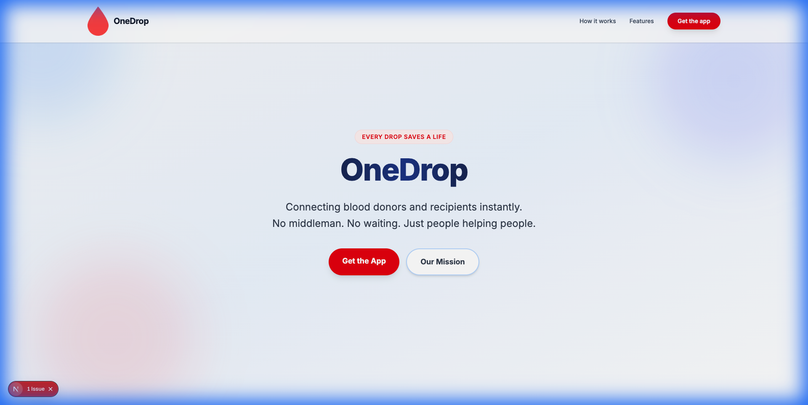
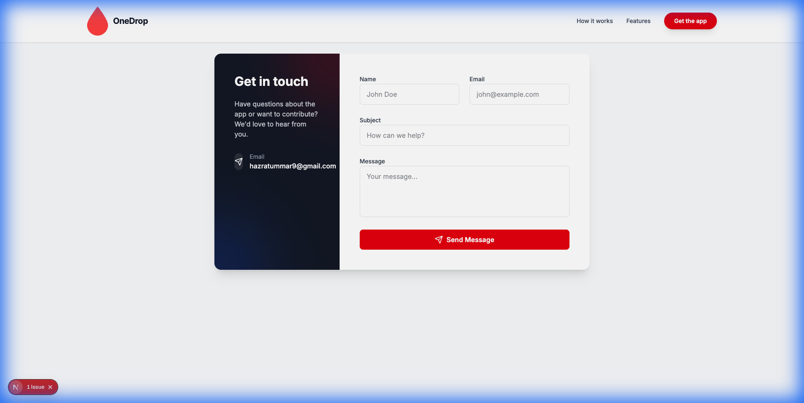

<div align="center">
  
  
  # 🩸 OneDrop Website
  
  **Every Drop Saves a Life**
  
  [](https://nextjs.org/)
  [](https://www.typescriptlang.org/)
  [](https://tailwindcss.com/)
  [](LICENSE)
  
  [Live Demo](https://onedrops.online) • [Report Bug](https://github.com/ihazratummar/OnedropWebsite/issues) • [Request Feature](https://github.com/ihazratummar/OnedropWebsite/issues)
  
</div>

---

## 📖 About The Project

OneDrop is a revolutionary blood donation platform that connects donors and recipients directly, eliminating intermediaries and reducing wait times in critical situations. This repository contains the official marketing website built with modern web technologies.

### ✨ Key Features

- 🎨 **Modern Design** - Clean, trustworthy UI with subtle blood donation theme
- ⚡ **Lightning Fast** - Optimized with Next.js 16, lazy loading, and image optimization
- 📱 **Fully Responsive** - Perfect experience on all devices
- 🔒 **Secure** - Discord webhook integration for contact form
- 🚀 **Production Ready** - Docker support with multi-stage builds
- ♿ **Accessible** - WCAG compliant with semantic HTML

---

## 🖼️ Screenshots

### Homepage


### Contact Page


---

## 🛠️ Built With

### Core Technologies
- **[Next.js 16](https://nextjs.org/)** - React framework with App Router
- **[TypeScript](https://www.typescriptlang.org/)** - Type-safe JavaScript
- **[Tailwind CSS v4](https://tailwindcss.com/)** - Utility-first CSS framework
- **[Framer Motion](https://www.framer.com/motion/)** - Animation library

### Additional Tools
- **[Lucide React](https://lucide.dev/)** - Beautiful icon set
- **[Zod](https://zod.dev/)** - Schema validation
- **[Discord Webhooks](https://discord.com/developers/docs/resources/webhook)** - Contact form integration

---

## 🚀 Getting Started

### Prerequisites

- Node.js 20.x or higher
- npm or yarn
- Git

### Installation

1. **Clone the repository**
   ```bash
   git clone https://github.com/ihazratummar/OnedropWebsite.git
   cd OnedropWebsite
   ```

2. **Install dependencies**
   ```bash
   npm install
   ```

3. **Set up environment variables**
   
   Create a `.env.local` file in the root directory:
   ```env
   DISCORD_CONTACT_WEBHOOK=your_discord_webhook_url_here
   NODE_ENV=development
   ```

4. **Run the development server**
   ```bash
   npm run dev
   ```

5. **Open your browser**
   
   Navigate to [http://localhost:3000](http://localhost:3000)

---

## 📦 Build & Deployment

### Production Build

```bash
npm run build
npm start
```

### Docker Deployment

The project includes a production-ready Dockerfile with multi-stage builds:

```bash
# Build the image
docker build -t onedrop-website:latest .

# Run the container
docker run -d \
  --name onedrop-website \
  --env-file .env.local \
  -p 8383:8383 \
  onedrop-website:latest
```

### CI/CD with Jenkins

The repository includes a `Jenkinsfile` for automated deployment:

- ✅ Automated builds on push
- ✅ Docker image creation
- ✅ Container deployment with health checks
- ✅ Automatic cleanup of old images

---

## 📁 Project Structure

```
onedrop-web/
├── public/                 # Static assets
│   ├── screenshots/        # App screenshots
│   ├── onedrop_logo.png   # Logo
│   └── favicon.ico        # Favicon
├── src/
│   ├── app/               # Next.js App Router
│   │   ├── actions.ts     # Server actions
│   │   ├── layout.tsx     # Root layout
│   │   ├── page.tsx       # Homepage
│   │   └── contact/       # Contact page
│   ├── components/        # React components
│   │   ├── home/          # Homepage sections
│   │   └── layout/        # Layout components
│   └── lib/               # Utilities
├── Dockerfile             # Multi-stage Docker build
├── Jenkinsfile           # CI/CD pipeline
└── next.config.ts        # Next.js configuration
```

---

## 🎯 Performance Optimizations

- ⚡ **Code Splitting** - Dynamic imports for below-the-fold content
- 🖼️ **Image Optimization** - Responsive `sizes` attributes
- 🗜️ **Production Build** - Automatic console.log removal
- 📦 **Standalone Output** - Minimal Docker image size
- 🔄 **Lazy Loading** - Components load on demand

---

## 🤝 Contributing

Contributions are what make the open-source community amazing! Any contributions you make are **greatly appreciated**.

1. Fork the Project
2. Create your Feature Branch (`git checkout -b feature/AmazingFeature`)
3. Commit your Changes (`git commit -m 'Add some AmazingFeature'`)
4. Push to the Branch (`git push origin feature/AmazingFeature`)
5. Open a Pull Request

---

## 📝 Environment Variables

| Variable | Description | Required |
|----------|-------------|----------|
| `DISCORD_CONTACT_WEBHOOK` | Discord webhook URL for contact form | Yes |
| `NODE_ENV` | Environment (development/production) | Yes |

---

## 📄 License

Distributed under the MIT License. See `LICENSE` for more information.

---

## 👨‍💻 Author

**Hazrat Ummar Shaikh**

- GitHub: [@ihazratummar](https://github.com/ihazratummar)
- Website: [onedrops.online](https://onedrops.online)

---

## 🙏 Acknowledgments

- [Next.js Documentation](https://nextjs.org/docs)
- [Tailwind CSS](https://tailwindcss.com)
- [Framer Motion](https://www.framer.com/motion/)
- [Lucide Icons](https://lucide.dev/)

---

<div align="center">
  
  **Made with ❤️ for saving lives**
  
  ⭐ Star this repo if you find it helpful!
  
</div>
